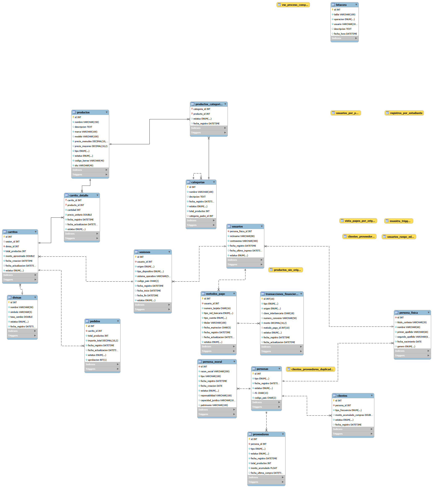

## Diagrama Entidad-Relación (DER)

El siguiente diagrama representa la estructura de la base de datos, incluyendo entidades principales, relaciones y cardinalidades:

#### Descripción
- Se incluyen entidades como: `usuarios`, `carritos`, `pedidos`, `productos`, etc.
- Se muestran relaciones 1:N y N:M
- Se consideran claves primarias y foráneas

#### Uso
Este diagrama permite comprender la estructura general del sistema y facilita el desarrollo, mantenimiento y análisis de la base de datos.