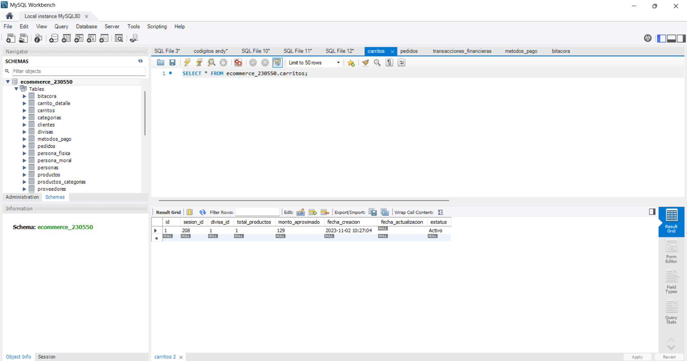
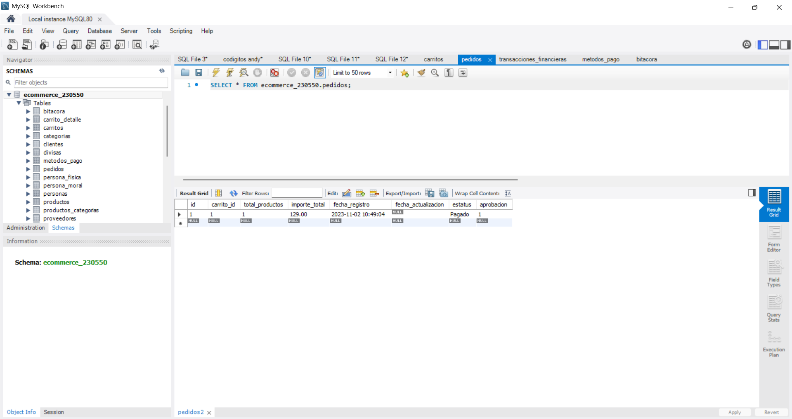
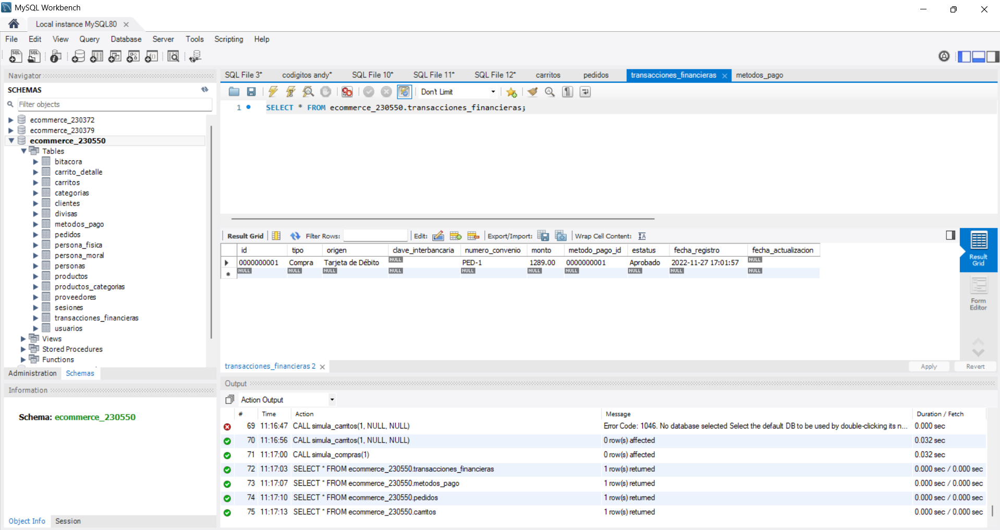

##Test 01: Compra completa
---
#### Descripción:

Este test valida el flujo completo de una compra dentro del sistema, desde la selección de productos hasta la confirmación de la transacción financiera.

####Objetivo

Verificar que el proceso de compra funcione correctamente de principio a fin sin errores.

####Flujo del proceso

1. Carrito
- El usuario agrega uno o más productos al carrito.
- Se valida que los productos y cantidades sean correctos.

2. Detalle
- Se revisa la información de la compra (productos, precios, totales).
- Se pueden ajustar cantidades o eliminar productos.

3. Pedido
- Se confirma la orden de compra.
- Se registran los datos del cliente y dirección (si aplica).

4. Transacción financiera
- Se procesa el pago.
- Se valida que la transacción sea aprobada.
- Se genera confirmación de la compra.

#### Estatus:
Exitosa.
