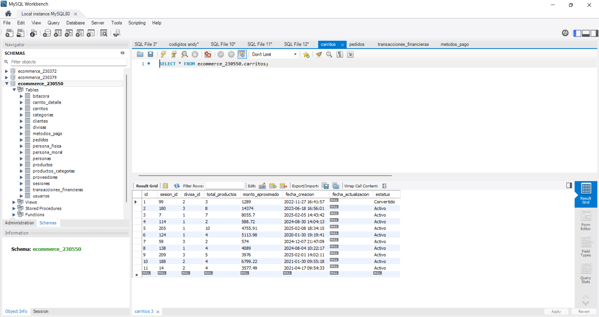

## Test 02: Compras en categoría "Perfumería"
---
#### Objetivo
Validar la correcta ejecución de compras múltiples filtradas por categoría, asegurando integridad de datos y consistencia en inventario y pagos.

#### Precondiciones
- Existencia de productos activos en la categoría "Perfumería".
- Stock disponible suficiente.
- Pasarela de pago operativa.
- Usuario válido (registrado o invitado según el flujo).

#### Flujo del proceso
- Consultar productos de la categoría "Perfumería".
- Seleccionar productos aleatorios o definidos.
- Agregar productos al carrito.
- Validar totales e impuestos en el detalle.
- Confirmar pedido.
- Ejecutar transacción financiera.
- Repetir el flujo hasta completar 10 compras.

#### Validaciones
- Categoría correcta en cada producto.
- Totales correctos (precio, impuestos, descuentos).
- Generación única de pedidos.
- Estado de pago: aprobado.

#### Resultado esperado
10 pedidos creados correctamente.
10 transacciones aprobadas.
Inventario actualizado tras cada compra.

### Posibles errores
Productos fuera de categoría.
Fallos en cálculo de totales.
Pagos rechazados o inconsistentes.

#### Evidencia

#### Estatus:
Exitosa.

