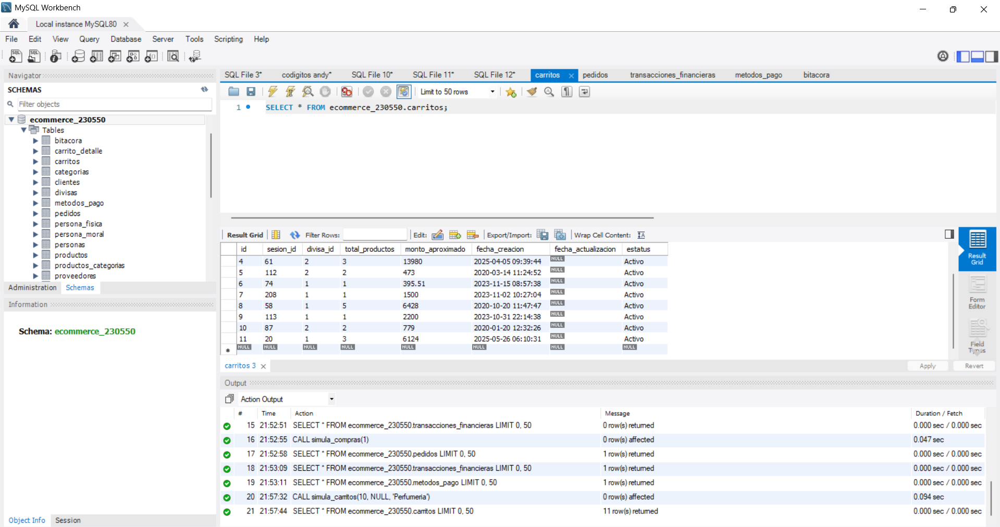

## Test 02: Compras en categoría "Perfumería"
---
#### Objetivo
Validar la correcta ejecución de compras múltiples filtradas por categoría, asegurando integridad de datos y consistencia en inventario y pagos.

## Descripción
Esta prueba tiene como objetivo validar la correcta inserción de registros de compras en la base de datos, específicamente para productos pertenecientes a la categoría **"Perfumería"**.

Se verifica que:
- Existan productos registrados en la categoría "Perfumería".
- Se puedan generar múltiples compras (10 registros).
- Las compras se almacenen correctamente en la tabla correspondiente (por ejemplo: `pedidos` o `transacciones_financieras`).
- Se mantenga la integridad de las relaciones entre tablas (`productos`, `categorias`, `carritos`, etc.).

#### Evidencia

#### Estatus:
Exitosa.

