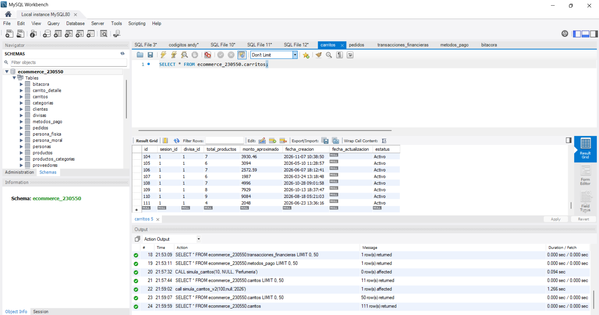

## Test 03: Compras en el año 2026
---
#### Objetivo
Validar la correcta asignación y persistencia de fechas en transacciones.

#### Descripción
Este caso de prueba tiene como objetivo validar la correcta generación y almacenamiento de **100 compras** dentro del sistema en el año **2026**, asegurando que los registros se inserten correctamente en la base de datos y cumplan con las condiciones esperadas.

#### Evidencias

