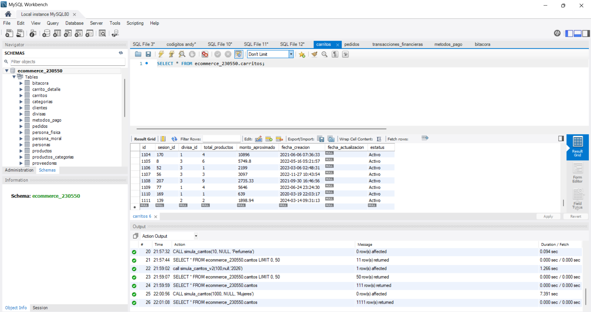

## Test 04: Compras en categoría "Ropa para mujer"
---
#### Objetivo
Evaluar comportamiento bajo alta carga.

#### Precondiciones
- Catálogo disponible
- Infraestructura preparada

#### Flujo del proceso
1. Filtrar productos por categoría
2. Generar compras
3. Ejecutar flujo completo
4. Alcanzar **1000 compras**

#### Validaciones
- Tiempos de respuesta
- Integridad de pedidos
- Consistencia en inventario

#### Resultado esperado
- 1000 compras exitosas
- Sistema estable

#### Posibles errores
- Caídas del sistema
- Tiempo de espera
- Inconsistencias

#### Evidencias

#### Estatus:
Exitosa.
