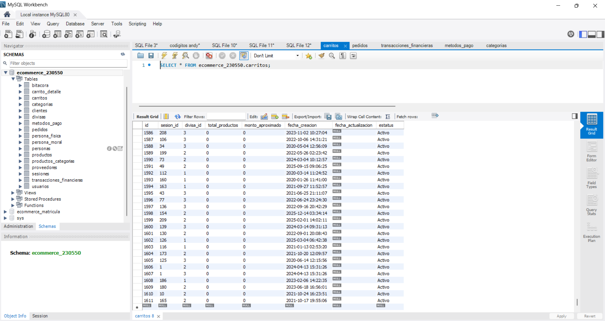

## Test 05: Compras en categoría "Ropa para hombre"
---
#### Objetivo
Validar estabilidad con carga media.

#### Precondiciones
- Productos disponibles
- Sistema funcional

#### Flujo del proceso
1. Seleccionar productos
2. Ejecutar compra completa
3. Repetir hasta **500 compras**

#### Validaciones
- Categorización correcta
- Pagos procesados
- Persistencia de pedidos

#### Resultado esperado
- 500 compras registradas
- Sistema estable

#### Posibles errores
- Fallos intermitentes
- Inconsistencias

#### Evidencias

Se debe incluir evidencia visual del resultado de la consulta ejecutada.

#### Estatus:
Exitosa.
