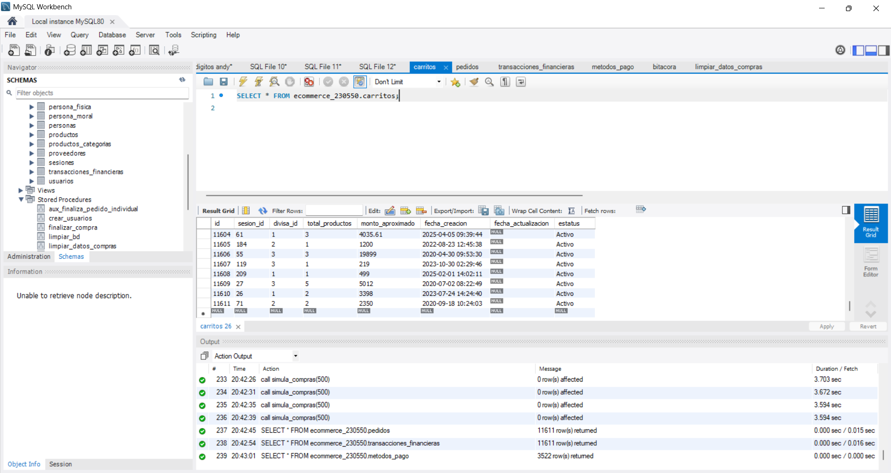
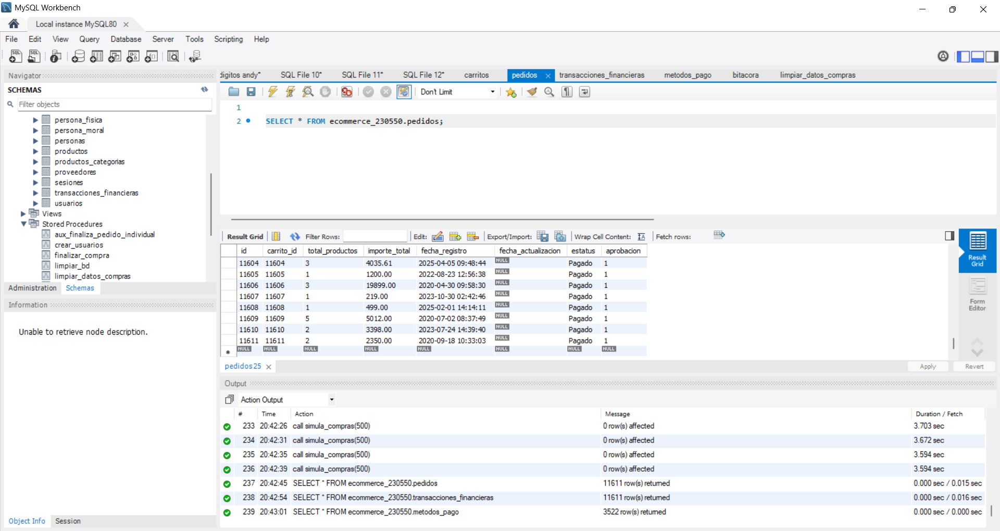
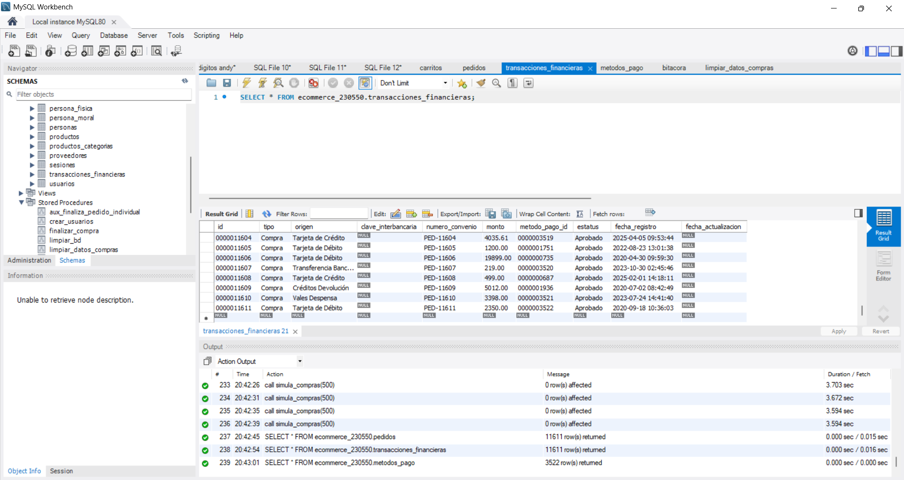
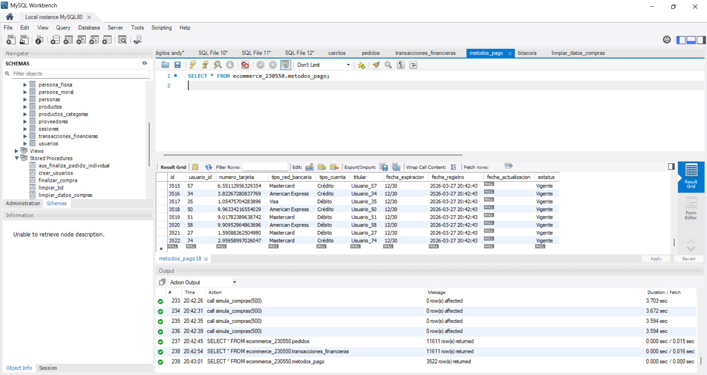

## Test 06: Compras generales masivas

#### Objetivo
Validar escalabilidad del sistema.

#### Precondiciones
- Infraestructura escalable
- Base de datos optimizada

#### Flujo del proceso
1. Generar compras sin restricción
2. Ejecutar flujo completo
3. Simular concurrencia
4. Alcanzar **10,000 compras**

#### Validaciones
- Throughput
- Tasa de errores
- Uso de recursos

#### Resultado esperado
- 10,000 compras procesadas
- Sistema estable

#### Posibles errores
- Saturación
- Caídas
- Problemas de concurrencia

#### Evidencias

Se debe incluir evidencia visual del resultado de la consulta ejecutada.

---

---

---

#### Estatus:
Exitosa.