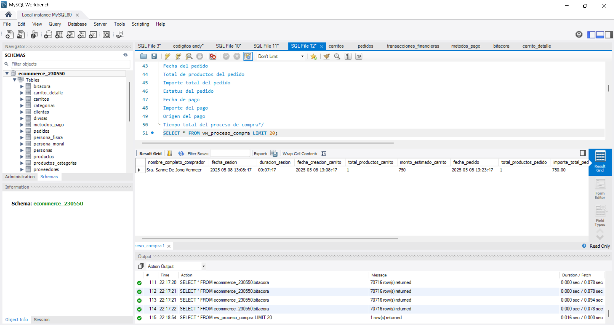

##  Test 07 – Consulta integral (Vista)

####  Objetivo
Generar una **vista** que consolide toda la información relevante del proceso de compra de un cliente, desde la sesión hasta el pago, permitiendo un análisis completo del flujo de compra.

#### Descripción
La vista integra información de múltiples tablas del sistema (clientes, sesiones, carrito, pedidos y pagos).

#### Campos requeridos
- Nombre completo del comprador  
- Fecha de sesión  
- Duración de la sesión  
- Fecha de creación del carrito  
- Total de productos del carrito  
- Monto estimado del carrito  
- Fecha del pedido  
- Total de productos del pedido  
- Importe total del pedido  
- Estatus del pedido  
- Fecha de pago  
- Importe del pago  
- Origen del pago  
- Tiempo total del proceso de compra  

#### Consideraciones técnicas

- Uso de **JOIN** entre tablas:
  - `clientes`
  - `sesiones`
  - `carrito`
  - `carrito_detalle`
  - `pedidos`
  - `pedido_detalle`
  - `pagos`

#### Funciones de agregación:
  - `COUNT()` → total de productos  
  - `SUM()` → importes

#### Evidencias

#### Estatus:
Exitosa.
