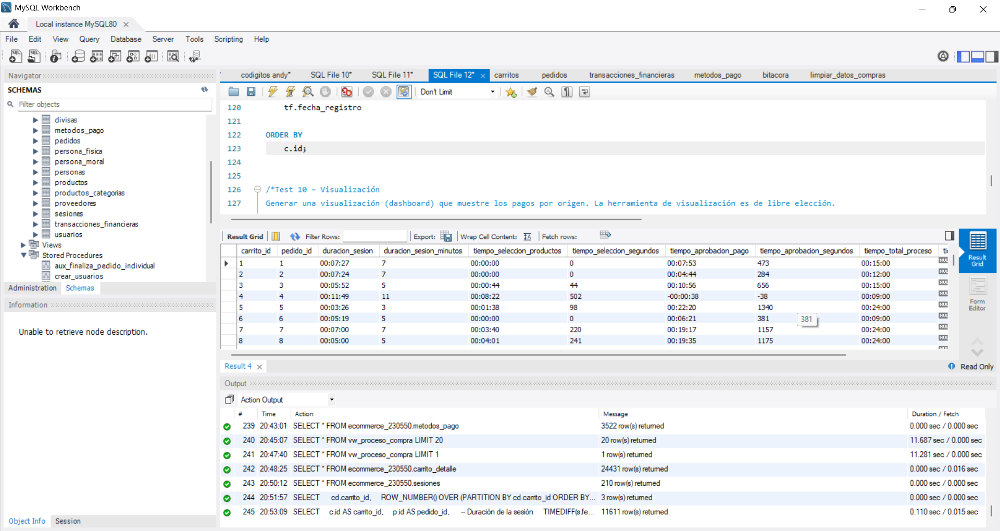

## Test 09 – Métricas de tiempo
---

#### Objetivo
Calcular indicadores de tiempo dentro del proceso de compra.

#### Descripción
Permite analizar la eficiencia del flujo desde la sesión hasta el pago.

#### Métricas requeridas
- Duración de la sesión

TIMESTAMPDIFF(SECOND, inicio_sesion, fin_sesion)

- Tiempo de selección de productos

TIMESTAMPDIFF(MINUTE, inicio_sesion, MAX(fecha_agregado))

- Tiempo de aprobación del pago

TIMESTAMPDIFF(MINUTE, fecha_pedido, fecha_pago)

Se deben considerar futuras métricas como:

- Tiempo de envío
- Tiempo de entrega

#### Evidencias

#### Estatus:
Exitosa.