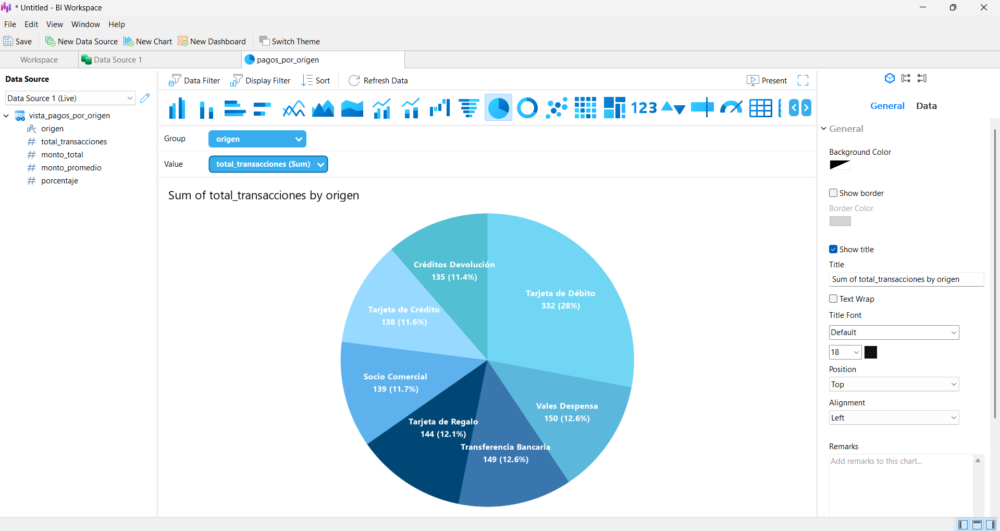

## Test 10 – Visualización

#### Objetivo
Generar una visualización (dashboard) que permita analizar los pagos en función de su origen.

#### Descripción
Se construyó una visualización utilizando **Navicat**, aprovechando sus herramientas de gráficos integradas para representar la distribución de los pagos según su origen.

#### Herramienta utilizada

- **Navicat Data Visualization**

#### Requerimientos cumplidos

- Clasificación de pagos por origen  
- Total de pagos por cada origen  
- Importe total acumulado por origen  
- Visualización clara mediante gráficos  

#### Consulta base utilizada 

#### Evidencias

#### Estatus:
Exitosa.

